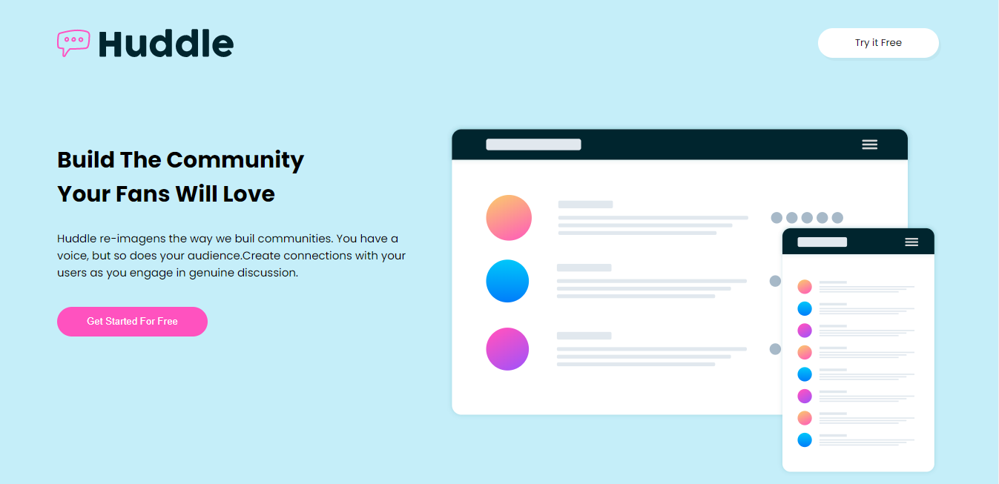

<h1 align="center">Huddle 🚀</h1>

<h3>Sobre o projeto</h3>

O Huddle é uma landing page de um dos desafios da plataforma do Frontend Mentor, com intuito de treinar os conhecimentos adquiridos.

  

 
  

 
  

<h3>Tecnologias 💻</h3>

O projeto foi desenvolvido com as seguintes tecnologias:

<ul>
  <li>HTML</li>
   <li>CSS</li>
</ul>
<h3>Como contribuir 😃</h3>
<ul>
  <li>Faça um fork desse repositório;</li>
  <li>Cria uma branch com a sua feature: git checkout -b minha-feature;</li> 
  <li>Faça commit das suas alterações: git commit -m 'feat: Minha nova feature';</li>
  <li>Faça push para a sua branch: git push origin minha-feature.</li>
  <li>Depois que o merge da sua pull request for feito, você pode deletar a sua branch.</li>
</ul>

